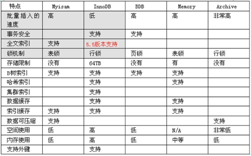
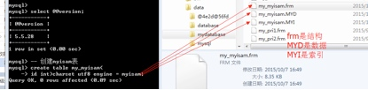

# SQL数据库基础Day5
####外键
+ foreign key，一个表中有一个字段（非主键）指向外部一张表的主键，那么该字段成为外键。
  - 增加外键
    * 创建时
    	 - `foreign key (字段名) references 另一张表名（字段名）`
    
	   	```sql
	    	-- 创建外键
			create table my_foreign1(
			id int primary key auto_increment,
			name varchar(20) not null comment '学生姓名',
			c_id int comment '班级id',
			-- 普通字段
			-- 增加外键
			foreign key(c_id) references my_class(id)
			)charset utf8;
	    	
    
    * 创建后，修改表结构
      - alter table add foreign key（外键字段）references 父表（主键字段）
      
      ```
      -- 增加外键
		alter table my_foreign2 add
		-- 指定外键名
		constraint student_class_1
		-- 指定外键字段
		foreign key(c_id)
		-- 引用父表主键
		references my_class(id);
      ```
   
   - 删除外键
     `alter table 表名 drop foeign key 外键名`  
     - 删除之后通过查看表创建语句查看
     - 一张表有多个外键，但名字不能相同
   
   - 外键作用
     - 对子表约束，约束数据写操作
     - 对父表约束，如果对应的主键在子表中已经被数据引用，那么就不允许操作。
   - 外键条件
     - 存储引擎必须是innodb，否则外键可以创建，但无约束效果。
     - 外键字段的数据类型，必须与父表主键相同
     - 外键名不能重复，任何外键创建失败，没有详细报错。
     - 增加外键数据（数据已经存在），必须保证数据与父表主键要求对应

####外键约束
> 外键约束的定制操作（约束模式，对父表）
- district:严格模式（默认），父表不能删除或更新一个已经被子表数据引用的记录
- cascade：级联模式：父表的操作，对应子表的数据也跟着操作
- setnull：置空模式，父表操作之后，子表对应数据（外键字段）被置空

- 通常一个合理的做法：删除的时候，子表置空，更新的时候采取级联操作
	- `foreign key(外键字段) references 父表（主键字段） on delete 模式 update 模式`
	
	```
	-- 创建外键: 指定模式: 删除置空,更新级联
	create table my_foreign3(
	id int primary key auto_increment,
	name varchar(20) not null,
	c_id int,
	-- 增加外键
	foreign key(c_id)
	-- 引用表
	references my_class(id)
	-- 指定删除模式
	on delete set null
	-- 指定更新默认
	on update cascade)charset utf8;
	
	```
  - 删除置空的前提条件：外键字段允许为空！如果不满足条件，外键无法创建。
  - 外键虽然能进行各种约束，但降低了JAVA对数据的可控性，实际开发中外键少用，但很重要！

####联合查询
- 将多次查询，在记录上进行拼接（字段不会增加）。
- 基本语法：多条select语句构成，每一条select语句或缺的字段数必须一致
  
  ```sql
  select 语句 1
  union[union 选项]
  select 语句 2...
  --union选项：与select选项一样有2个
      All：保留所有
      distinct：去重：默认
  ```
- 意义
  - 查询同一张表，但需求不同，如查询学生信息，男生生序，女生降序
  - 多表查询：多表查询：多张表的结构是一样的，保存的数据（结构也是一样的）。

- order by使用
  - 在联合查询中order by必须对查询语句扩起来
  - order by生效，必须加limit

	```
	-- 需求: 男生升序,女生降序(年龄)
	(select * from my_student where sex = '男' order by age asc limit 9999999)
	union 
	(select * from my_student where sex = '女' order by age desc limit 9999999);
	```
- 子查询
  - sub query，查询是在某个查询结果之上进行的（一条select语句内部包含了另外一条select语句）
  - 按位置分类：from子查询 和 where子查询
  - 按照结果分类：
    - 标量子查询（where之后，一行一列） 
    - 列子查询（where之后，一列多行）
    - 行子查询（where之后，一行多列）
    - 表子查询（from之后，多行多列）

- 标量子查询
	- 返回班级为PHP0710的班级学生
	
	```
	--标量子查询
	select * from my_student where c_id = (select id from my_class where c_name = 'PHP0710');
	select * from my_student having c_id = (select id from my_class where c_name = 'PHP0710');
	```
- 行子查询

	```sql
	select * from my_student where 
	-- (age,height)称之为行元素
	(age,height) = (select max(age),max(height) from my_student);
	```
- 表子查询
  - 返回的结构当作二维表使用
  ```sql
  -- 表子查询
	select * from (select * from my_student order by height desc) as student group by c_id;
  ```
- exits子查询
  - 判断是某满足条件
  - where之后,exits返回的结果只有0和1
	
	```sql
	-- exists子查询
	select * from my_student where 
	exists(select * from my_class where id = 1);
	
	select * from my_student where 
	exists(select * from my_class where id = 2);
	```

####视图
- 一种有结构（有行有列）但无结果（结构中不实际放置数据）的虚拟表。
- 创建
  - create view 视图名字 as select 语句 -- select语句可以是普通查询，可以是联合查询，也可以是子查询
  - 视图：单表+多表
  
  ```sql
  create view my_v1 as 
	select * from my_student;
	
	create view my_v2 as 
	select * from my_class;
	
	--错误
	create view my_v3 as 
	select * from my_student as s left join my_class c on s.c_id = c.id; -- id重复(视图基表字段名不能重复)
	
	--修改后多表
	create view my_v3 as 
	select s.*,c.c_name,c.room from my_student as s 
	left join my_class c 
	on s.c_id = c.id;
  ``` 
  
- 视图一旦创建，系统会在对应的数据库文件夹下创建一个对应的结构文件frm文件
- show create view 视图名\G
- 使用视图（主要是查询，就像使用表一样）`select * from 视图名;`
  - 视图的执行其实本质就是执行封装的sql语句
- 修改视图&删除视图
 - 修改视图来源语句（select语句）
 - `alter view my_v1 as select id,name,age,sex,height,c_id from my_student;`
 - `drop view 视图` 
- 视图好处
 

- 视图数据操作
 - 新增数据
   - 多表视图不能插入数据
   - 可以向单表视图插入数据，但视图中包含的字段必须有基表中所有不能为空，或者没默认值的字段
 - 删除数据
   - `delete from 基表名 where 条件`
   - 多表视图无法删除数据
   - 单表视图可以删除数据
 - 更新数据
   - `update my_v3 set c_id = 3 where id = 5;`
   - 更新限制，with check option，视图新增时，有字段更新，系统会进行验证。  
   
   ```
   -- 视图: age字段限制更新
	create view my_v4 as 
	select * from my_student where age > 30 with check option;
	-- 表示视图的数据来源都是年龄大于30岁:where age > 30决定
	-- with check option: 决定通过视图更新的时候,不能将已经得到的数据age > 30的改成小于30的
   ```
   
 - 视图算法选择：？？？
 

####数据备份与还原
- 数据备份还原方式：数据表备份、表单数据备份、SQL备份、增量备份
- 数据表备份
  - 不需要SQL来备份，直接进入到数据库文件复制对应表结构，根据存储引擎区分。 
  - 存储引擎：myisan（免费）和innodb（免费）
  
    
  - innodb：只有表结构，数据全部存储在ibdata1文件中
  - myisam：表数据和索引全部分开存储

	```
	-- 创建myisam表
	create table my_myisam(
	id int)charset utf8 engine = myisam;
	备份时直接复制三个文件
	```
     

 - 单表数据备份：每次只能备份一张表，只能备份数据（表结构不能备份）
 - 从表中选出一部分数据保存到外部文件中（outfile），前提外部文件不存在。
 

 ```
 -- 单表数据备份
	select * into outfile 'D:/server/temp/student.txt' from my_student;
	select * into outfile 'D:/server/temp/class.txt' from my_class;
 ```
- 高级备份：


- SQL备份
  


- 增量备份（大项目）


