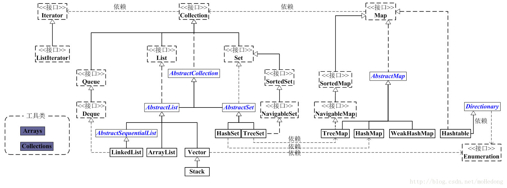

#JAVA SE 基础总结（15-18）

##Day15
1. 集合(Collection)(掌握)
	- 集合的由来?
		- 我们学习的是Java -- 面向对象 -- 操作很多对象 -- 存储 -- 容器(数组和StringBuffer) -- 数组
		- 而数组的长度固定，所以不适合做变化的需求，Java就提供了集合供我们使用。
	- 集合和数组的区别?
		- 长度区别
			- 数组固定
			- 集合可变
		- 内容区别
			- 数组可以是基本类型，也可以是引用类型
			- 集合只能是引用类型
		- 元素内容
			- 数组只能存储同一种类型
			- 集合可以存储不同类型(其实集合一般存储的也是同一种类型)
	- 集合的继承体系结构?
		- 由于需求不同，Java就提供了不同的集合类。这多个集合类的数据结构不同，但是它们都是要提供存储和遍历功能的，
		- 我们把它们的共性不断的向上提取，最终就形成了集合的继承体系结构图。
		
		```
		Collection
			|--List
				|--ArrayList
				|--Vector
				|--LinkedList
			|--Set
				|--HashSet
				|--TreeSet
		```
	- Collection集合的遍历
		- 把集合转数组(了解)
		- 迭代器(集合专用方式)
	- 迭代器
	   - 为什么定义为了一个接口而不是实现类?**Iterator接口**
	
	  ```
			//A:存储字符串并遍历
			import java.util.Collection;
			import java.util.ArrayList;
			import java.util.Iterator;
			
			public class CollectionDemo {
				public static void main(String[] args) {
					//创建集合对象
					Collection c = new ArrayList();
					
					//创建并添加元素
					c.add("hello");
					c.add("world");
					c.add("java");
					
					//遍历集合
					Iterator it = c.iterator();
					while(it.hasNext()) {
						String s =(String) it.next();
						System.out.println(s);
					}
				}
			}
		```
2. 集合(List)(掌握)
	- List是Collection的子接口
		- 有序(存储顺序和取出顺序一致)，可重复。
	- 并发修改异常
		
		```
		public class ListDemo {
			public static void main(String[] args) {
				// 创建List集合对象
				List list = new ArrayList();
				// 添加元素
				list.add("中国");
				list.add("美国");
				list.add("日本");
			
			
			   迭代器遍历 出现异常
				Iterator it = list.iterator();
				while (it.hasNext()) {
				String s = (String) it.next();
				if ("中国".equals(s)) {
					list.add("韩国");
				}
			}
				方案1：迭代器迭代元素，迭代器修改元素
			// 而Iterator迭代器却没有添加功能，所以我们使用其子接口ListIterator
			 	ListIterator lit = list.listIterator();
			 	while (lit.hasNext()) {
				 	String s = (String) lit.next();
				 	if ("中国".equals(s)) {
				 		lit.add("韩国");
				 	}
				 }
			  方案2：集合遍历元素，集合修改元素(普通for)
			for (int x = 0; x < list.size(); x++) {
				String s = (String) list.get(x);
				if ("中国".equals(s)) {
					list.add("韩国");
				}
			 }
			System.out.println("list:" + list);
			}
		}
		```
	- 常见数据结构
		- 栈 先进后出
		- 队列 先进先出
		- 数组 查询快，增删慢
		- 链表 查询慢，增删快
	- List的子类特点(面试题)
		- ArrayList
			- 底层数据结构是数组，查询快，增删慢。
			- 线程不安全，效率高。
		- Vector
			- 底层数据结构是数组，查询快，增删慢。
			- 线程安全，效率低。
		- LinkedList
			- 底层数据结构是链表，查询慢，增删快。
			- 线程不安全，效率高。
			
		- 到底使用谁呢?看需求?
			- 要安全吗?
				- 要：Vector(即使要，也不使用这个，后面再说)
				- 不要：ArrayList或者LinkedList
					- 查询多；ArrayList
					- 增删多：LinkedList
			- 什么都不知道，就用ArrayList。

##Day16
1. LinkedList
	- 特有功能	
		- 添加
			- addFirst()
			- addLast()
		- 删除
			- removeFirst()
			- removeLast()
		- 获取
			- getFirst()
			- getLast()
2. 泛型(掌握)
	- 泛型高级通配符
	  - ?
	  - ? extends E
	  - ? super E
   - 一般是在集合中使用。
3. 增强for循环(掌握)
	- 好处：
		- 简化了数组和集合的遍历
	- 弊端
		- 增强for循环的目标不能为null。建议在使用前，先判断是否为null。
4. 静态导入(了解)
	- 格式：
		- import static 包名....类名.方法名;
	- 注意事项：
		- 方法必须是静态的
		- 如果多个类下有同名的方法，就不好区分了，还得加上前缀。
			- 所以一般我们并不使用静态导入，但是一定要能够看懂。
5. 可变参数(掌握)
	- 格式：
		- 修饰符 返回值类型 方法名(数据类型... 变量) {}
		- 注意：
			- 该变量其实是一个数组名
			- 如果一个方法有多个参数，并且有可变参数，可变参数必须在最后
	- Arrays工具类的一个方法
		- asList()把数组转成集合。
		- 注意：这个集合的长度不能改变。

##Day17
1. Set集合(理解)
	- Set集合的特点
		- 无序,唯一
	- HashSet集合(掌握)
		- 底层数据结构是哈希表(是一个元素为链表的数组)
		- 哈希表底层依赖两个方法：hashCode()和equals()
		
		  ```
		  - 执行顺序：
			 - 首先比较哈希值是否相同
				- 相同：继续执行equals()方法
					- 返回true：元素重复了，不添加
					- 返回false：直接把元素添加到集合
				- 不同：就直接把元素添加到集合
		  ```
		- 重写hashcode(),equals()方法：非常的简单，自动生成即可。
	- TreeSet集合
		- 底层数据结构是红黑树(是一个自平衡的二叉树)
		- 保证元素的排序方式
			- 自然排序(元素具备比较性)
				- 让元素所属的类实现Comparable接口
			- 比较器排序(集合具备比较性)
				- 让集合构造方法接收Comparator的实现类对象
		
		```
		//自然排序
		1.需要存储并排序的类,继承Comparable接口。
		2.重写comparato方法.
		//比较器排序
		方式一：
		TreeSet<Student> ts = new TreeSet<Student>(new 			Comparator<Student>() {
			public int compare(Student s1, Student s2) {
				// 总分从高到低
				int num = s2.getSum() - s1.getSum();
				// 总分相同的不一定语文相同
				// 总分相同的不一定数序相同
				// 总分相同的不一定英语相同
				// 姓名还不一定相同呢
				return num5;
			}
		});
		方式2:
		1.创建类继承Comparator类
		2.TreeSet<Student> ts = new TreeSet<Student>(new MyCom()); 
		```

##Day18
1. Map(掌握)
	- Map集合的遍历
		- 键找值
			- 获取所有键的集合
			- 遍历键的集合,得到每一个键
			- 根据键到集合中去找值
		- 键值对对象找键和值
			- 获取所有的键值对对象的集合
			- 遍历键值对对象的集合，获取每一个键值对对象
			- 根据键值对对象去获取键和值
		 
		 ```
			Map<String,String> hm = new HashMap<String,String>();
			hm.put("it002","hello");
			hm.put("it003","world");
			hm.put("it001","java");
			
			//方式1 键找值
			Set<String> set = hm.keySet();
			for(String key : set) {
				String value = hm.get(key);
				System.out.println(key+"---"+value);
			}
			//方式2 键值对对象找键和值
			Set<Map.Entry<String,String>> set2 = hm.entrySet();
			for(Map.Entry<String,String> me : set2) {
				String key = me.getKey();
				String value = me.getValue();
				System.out.println(key+"---"+value);
			}
	    ```
	  
2. Collections(理解)	
	- 是针对集合进行操作的工具类
	- 面试题：Collection和Collections的区别
		- Collection 是单列集合的顶层接口，有两个子接口List和Set
		- Collections 是针对集合进行操作的工具类，可以对集合进行排序和查找等
	- 常见的几个小方法：
		- `public static <T> void sort(List<T> list)`:排序
		- `public static <T> int binarySearch(List<?> list,T key)`:二分查找
		- `public static <T> T max(Collection<?> coll)`:最大
		- `public static void reverse(List<?> list)`:倒序
		- `public static void shuffle(List<?> list)`:重排




