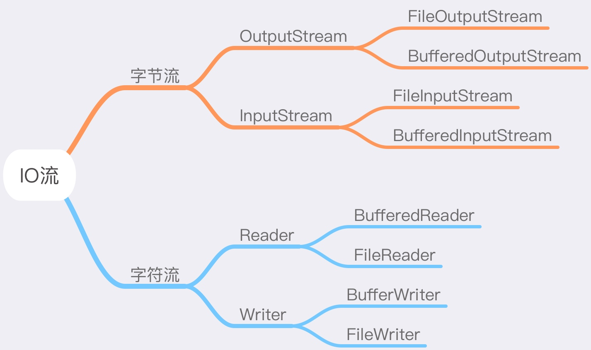

# JAVA SE 基础总结（19-22）

##Day19
1. 异常(理解)
	- 异常的体系
		
		```
		Throwable
			|--Error	严重问题，我们不处理。
			|--Exception
				|--RuntimeException 运行期异常，我们需要修正代码
				|--非RuntimeException 编译期异常，必须处理的，否则程序编译不通过
		```
	- 异常的处理：
		- try...catch...finally
			- 自己编写处理代码,后面的程序可以继续执行
		- throws
			- 把自己处理不了的，在方法上声明，告诉调用者，这里有问题
	- 面试题
		- 编译期异常和运行期异常的区别?
			- 编译期异常 必须要处理的，否则编译不通过
			- 运行期异常 可以不处理，也可以处理
		- throw和throws是的区别
			- throw:
				- 在方法体中,后面跟的是异常对象名,并且只能是一个
				- throw抛出的是一个异常对象，说明这里肯定有一个异常产生了
			- throws:
				- 在方法声明上,后面跟的是异常的类名,可以是多个
				- throws是声明方法有异常，是一种可能性，这个异常并不一定会产生
	- finally关键字及其面试题
		- A:finally用于释放资源，它的代码永远会执行。特殊情况：在执行到finally之前jvm退出了
		- 面试题
			- final,finally,finalize的区别?
			- 如果在catch里面有return,请问finally还执行吗?如果执行,在return前还是后
				- 会，前。
		- 异常处理的变形
			
			```
			try...catch...finally
			try...catch...
			try...catch...catch...
			try...catch...catch...fianlly
			try...finally
			```
	- 自定义异常
		- 继承自Exception或者RuntimeException,只需要提供无参构造和一个带参构造即可
	- 异常的注意实现
		- 父的方法有异常抛出,子的重写方法在抛出异常的时候必须要小于等于父的异常 
		- 父的方法没有异常抛出,子的重写方法不能有异常抛出
		- 父的方法抛出多个异常,子的重写方法必须比父少或者小

2. File(掌握)
	- 构造方法
	
		```
		A:File file = new File("e:\\demo\\a.txt");
		B:File file = new File("e:\\demo","a.txt");
		C:File file = new File("e:\\demo");
		  File file2 = new File(file,"a.txt");
		```
	- File类的功能(自己补齐)
		- 创建功能
		- 删除功能
		- 重命名功能
		- 判断功能
		- 获取功能
		- 高级获取功能
		- 过滤器功能
		
		```java
		文件过滤器
		String[] strArray = file.list(new FilenameFilter() {
			public boolean accept(File dir, String name) {
					return new File(dir, name).isFile() && name.endsWith(".jpg");
			}
		});
		```
##Day20
1. IO流(掌握)
	- IO用于在设备间进行数据传输的操作
	- FileOutputStream写出数据

			```
			FileOutputStream fos = new FileOutputStream("fos.txt");
			fos.write("hello".getBytes());
			fos.close();
			```
	   - 如何实现数据的追加写入?`new FileOutputStream("fos.txt",true);`
	
	- FileInputStream读取数据

		  ```java
			FileInputStream fis = new FileInputStream("fos.txt");
			//方式1
			int by = 0;
			while((by=fis.read())!=-1) {
				System.out.print((char)by);
			}
			
			//方式2
			byte[] bys = new byte[1024];
			int len = 0;
			while((len=fis.read(bys))!=-1) {
				System.out.print(new String(bys,0,len));
			}
			fis.close();
			```
	- 字节缓冲区流
		- BufferedOutputStream
		- BufferedInputStream
- IO流分类



##Day21
1. 字符流(掌握)
	- 转换流其实是一个字符流
		- 字符流 = 字节流 + 编码表
	- IO流中的编码问题
		- OutputStreamWriter
			- OutputStreamWriter(OutputStream os):默认编码，GBK
			- OutputStreamWriter(OutputStream os,String charsetName):指定编码。
		- InputStreamReader
			- InputStreamReader(InputStream is):默认编码，GBK
			- InputStreamReader(InputStream is,String charsetName):指定编码
	- 字符流

     ```
		Reader
			|--InputStreamReader
				|--FileReader
			|--BufferedReader
		Writer
			|--OutputStreamWriter
				|--FileWriter
			|--BufferedWriter
	     ```
2. IO流小结(掌握)
   
  ```
	IO流
		|--字节流
			|--字节输入流
				InputStream
					int read():一次读取一个字节
					int read(byte[] bys):一次读取一个字节数组
				
					|--FileInputStream
					|--BufferedInputStream
			|--字节输出流
				OutputStream
					void write(int by):一次写一个字节
					void write(byte[] bys,int index,int len):一次写一个字节数组的一部分
					
					|--FileOutputStream
					|--BufferedOutputStream
		|--字符流
			|--字符输入流
				Reader
					int read():一次读取一个字符
					int read(char[] chs):一次读取一个字符数组
					
					|--InputStreamReader
						|--FileReader
					|--BufferedReader
						String readLine():一次读取一个字符串
			|--字符输出流
				Writer
					void write(int ch):一次写一个字符
					void write(char[] chs,int index,int len):一次写一个字符数组的一部分
					
					|--OutputStreamWriter
						|--FileWriter
					|--BufferedWriter
						void newLine():写一个换行符
						
						void write(String line):一次写一个字符串
		  
		   
		
##Day22
1. 数据操作流(操作基本类型数据的流)(理解)
	- 可以操作基本类型的数据
	- 流对象名称	
		- DataInputStream
		- DataOutputStream

2. 内存操作流(理解)
	- 有些时候我们操作完毕后，未必需要产生一个文件，就可以使用内存操作流。
	- 三种
		- ByteArrayInputStream,ByteArrayOutputStream
		- CharArrayReader,CharArrayWriter
		- StringReader,StringWriter

3. 打印流(掌握)
	- 字节打印流，字符打印流
	- 特点：
		- 只操作目的地,不操作数据源
		- 可以操作任意类型的数据
		- 如果启用了自动刷新，在调用println()方法的时候，能够换行并刷新
	- 复制文本文件

	   ```java
		BufferedReader br = new BufferedReader(new FileReader("a.txt"));
		PrintWriter pw = new PrintWriter(new FileWriter("b.txt"),true);
		
		String line = null;
		while((line=br.readLine())!=null) {
			pw.println(line);
		}
		
		pw.close();
		br.close();
		```	
4. 标准输入输出流(理解)
	- System类下面有这样的两个字段
		- in 标准输入流
		- out 标准输出流
	- 三种键盘录入方式
		- main方法的args接收参数
		- System.in通过BufferedReader进行包装
			- BufferedReader br = new BufferedReader(new InputStreamReader(System.in));
		- Scanner
			- Scanner sc = new Scanner(System.in);
	- 输出语句的原理和如何使用字符流输出数据
		- 原理
		
		   ```
			System.out.println("helloworld");
			<----等价---->
			PrintStream ps = System.out;
			ps.println("helloworld");
		   ```
		- 把System.out用字符缓冲流包装一下使用
			- BufferedWriter bw = new BufferedWriter(new OutputStreamWriter(System.out));

5. 随机访问流(理解)
	- 可以按照文件指针的位置写数据和读数据。
6. 合并流(理解)
	- 把多个输入流的数据写到一个输出流中。
	- 构造方法：
		- SequenceInputStream(InputStream s1, InputStream s2) 
		- SequenceInputStream(Enumeration<? extends InputStream> e) 

7. 序列化流(理解)
	- 可以把对象写入文本文件或者在网络中传输
	- 如何实现序列化呢?
		- 让被序列化的对象所属类实现 `Serializable` 接口。
		- 该接口是一个标记接口。没有功能需要实现。
	* 注意问题：
		- 把数据写到文件后，在去修改类会产生一个问题。
		- 如何解决该问题呢?
			- 在类文件中，给出一个固定的序列化id值。
			- 而且，这样也可以解决黄色警告线问题
			
8. Properties(理解)
	- 是一个集合类，Hashtable的子类
	- 特有功能
		- public Object setProperty(String key,String value)
		- public String getProperty(String key)
		- public Set<String> stringPropertyNames()
	- 和IO流结合的方法
		-  把键值对形式的文本文件内容加载到集合中
			- public void load(Reader reader)
			- public void load(InputStream inStream)

		- 把集合中的数据存储到文本文件中
			- public void store(Writer writer,String comments)
		 	- public void store(OutputStream out,String comments)

9. NIO(了解)
	- JDK4出现的NIO，对以前的IO操作进行了优化，提供了效率。但是大部分我们看到的还是以前的IO
	- JDK7的NIO的使用	
		- Path:路径
		- Paths:通过静态方法返回一个路径
		- Files:提供了常见的功能
			- 复制文本文件
			- 把集合中的数据写到文本文件

####IO流源代码
- FileOutputStream
	
	```java
		FileOutputStream fos = new FileOutputStream("fos.txt");
		
		fos.write("hello,IO".getBytes());
		
		fos.close();
	```
- FileInputStream

  ```java
  		FileInputStream fis = new FileInputStream("FileOutputStreamDemo.java");
		
		int by = 0;
		
		while ((by = fis.read()) != -1) {
			System.out.print((char) by);
		}
		
		fis.close();
  ```
- BufferInputStream
  
  ```java
  		BufferedInputStream bis = new BufferedInputStream(new FileInputStream(
				"bos.txt"));
		byte[] bys = new byte[1024];
		int len = 0;
		while ((len = bis.read(bys)) != -1) {
			System.out.print(new String(bys, 0, len));
		}
		bis.close();
  ```
- BufferOutputStream

	```java
		BufferedOutputStream bos = new BufferedOutputStream(
				new FileOutputStream("bos.txt"));
		bos.write("hello".getBytes());
		bos.close();
	```
- InputStreamReader

	```java
		InputStreamReader isr = new InputStreamReader(new FileInputStream(
				"osw.txt"), "UTF-8");

		int ch = 0;
		while ((ch = isr.read()) != -1) {
			System.out.print((char) ch);
		}

		isr.close();
	```
- OutputStreamWrite

	```java
		OutputStreamWriter osw = new OutputStreamWriter(new FileOutputStream(
				"osw.txt"), "UTF-8"); // 指定UTF-8
		// 写数据
		osw.write("中国");
		// 释放资源
		osw.close();
	```
- BufferRead
  
  ```java
  		BufferedReader br = new BufferedReader(new FileReader("bw.txt"));
		char[] chs = new char[1024];
		int len = 0;
		while ((len = br.read(chs)) != -1) {
			System.out.print(new String(chs, 0, len));
		}
		br.close();
  ```
- BufferWrite

  ```java
		BufferedWriter bw = new BufferedWriter(new FileWriter("bw.txt"));

		bw.write("hello");
		bw.write("java");
		bw.flush();

		bw.close();
  ```

